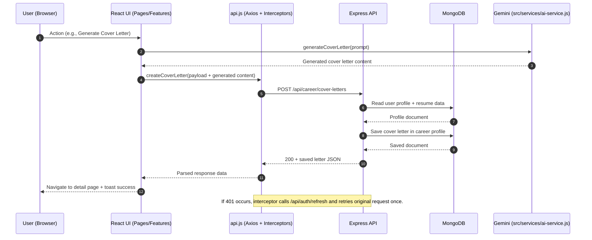
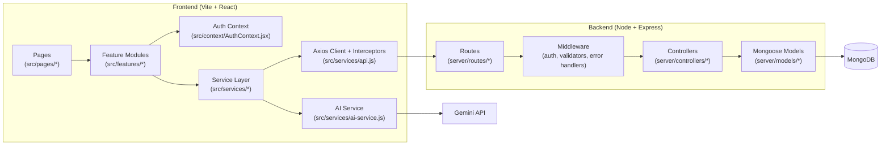

# AI Career Coach - Deep Dive with Real Code Snippets

Generated on 2026-03-24 from your current codebase.

---

## 1) Project Entry and Route Wiring

### File location
- `src/main.jsx`
- `src/App.jsx`

### Code snippet (`src/main.jsx`)
```jsx
ReactDOM.createRoot(document.getElementById("root")).render(
  <React.StrictMode>
    <AuthProvider>
      <BrowserRouter>
        <App />
        <Toaster richColors />
      </BrowserRouter>
    </AuthProvider>
  </React.StrictMode>
);
```

### What this does
- Boots the app
- Wraps app with auth context
- Enables routing
- Enables toast notifications globally

### Code snippet (`src/App.jsx`)
```jsx
function RequireAuth({ children }) {
  const { user, isLoading } = useAuth();

  if (isLoading) {
    return <BarLoader className="mt-4" width="100%" color="gray" />;
  }

  if (!user) {
    return <Navigate to="/sign-in" replace />;
  }

  return children;
}
```

```jsx
<Route path="/dashboard" element={<RequireAuth><DashboardPage /></RequireAuth>} />
<Route path="/onboarding" element={<RequireAuth><OnboardingPage /></RequireAuth>} />
<Route path="/resume" element={<RequireAuth><ResumePage /></RequireAuth>} />
<Route path="/ai-cover-letter" element={<RequireAuth><CoverLettersPage /></RequireAuth>} />
<Route path="/interview" element={<RequireAuth><InterviewPage /></RequireAuth>} />
```

### What this does
- Public routes: `/`, `/sign-in`, `/sign-up`
- Protected routes: dashboard, onboarding, resume, cover-letter, interview
- Blocks unauthenticated access

---

## 2) Auth Context (Global Session State)

### File location
- `src/context/AuthContext.jsx`
- Alias re-export: `src/context/auth-context.jsx`

### Code snippet
```jsx
const hydrateUser = useCallback(async () => {
  try {
    const currentUser = await getCurrentUser();
    setUser(currentUser || null);
  } finally {
    setIsLoading(false);
  }
}, []);
```

```jsx
useEffect(() => {
  hydrateUser();

  const handleSessionUpdate = () => {
    hydrateUser();
  };

  window.addEventListener(STORE_EVENT, handleSessionUpdate);

  return () => {
    window.removeEventListener(STORE_EVENT, handleSessionUpdate);
  };
}, [hydrateUser]);
```

### What this does
- Restores user on app load
- Re-hydrates user when auth store event is emitted
- Exposes `signIn`, `signUp`, `signOut`, `user`, `isLoading`

---

## 3) All Pages Explained with Real Code

## 3.1 Home Page

### File location
- `src/pages/home-page.jsx`

### Core snippet
```jsx
{features.map((feature, index) => {
  const FeatureIcon = feature.icon;
  return (
    <Card key={`${feature.title}-${index}`}>
      <CardContent>
        <FeatureIcon className="mb-4 h-10 w-10 text-primary" />
        <h3>{feature.title}</h3>
        <p>{feature.description}</p>
      </CardContent>
    </Card>
  );
})}
```

### Purpose
- Marketing landing page
- Reads static data from `data/` and renders sections

## 3.2 Sign In Page

### File location
- `src/pages/sign-in-page.jsx`

### Core snippet
```jsx
const handleSubmit = async (event) => {
  event.preventDefault();

  try {
    await signIn({ email, password });
    const { isOnboarded } = await getUserOnboardingStatus();
    navigate(isOnboarded ? "/dashboard" : "/onboarding", { replace: true });
    toast.success("Welcome back");
  } catch (error) {
    toast.error(error.message || "Sign in failed");
  }
};
```

### Purpose
- Authenticates user
- Redirects based on onboarding completion

## 3.3 Sign Up Page

### File location
- `src/pages/sign-up-page.jsx`

### Core snippet
```jsx
const handleSubmit = async (event) => {
  event.preventDefault();

  try {
    await signUp({ name, email, password });
    toast.success("Account created successfully");
    navigate("/onboarding", { replace: true });
  } catch (error) {
    toast.error(error.message || "Sign up failed");
  }
};
```

### Purpose
- Registers new user
- Routes to onboarding

## 3.4 Dashboard Page

### File location
- `src/pages/dashboard-page.jsx`

### Core snippet
```jsx
const run = async () => {
  try {
    const { isOnboarded } = await getUserOnboardingStatus();
    if (!isOnboarded) {
      navigate("/onboarding", { replace: true });
      return;
    }

    const result = await getIndustryInsights();
    setInsights(result);
  } catch (err) {
    setError(err.message || "Failed to load dashboard");
  } finally {
    setLoading(false);
  }
};
```

### Purpose
- Guards onboarding requirement
- Fetches and shows industry insights

## 3.5 Onboarding Page

### File location
- `src/pages/onboarding-page.jsx`

### Core snippet
```jsx
const isEditMode = searchParams.get("edit") === "true";

if (isOnboarded && !isEditMode) {
  navigate("/dashboard", { replace: true });
  return;
}
```

### Purpose
- First-time onboarding and profile editing mode

## 3.6 Resume Page

### File location
- `src/pages/resume-page.jsx`

### Core snippet
```jsx
const resume = await getResume();
setInitialContent(resume?.content || "");
```

### Purpose
- Loads saved resume markdown and opens resume builder

## 3.7 Cover Letters List Page

### File location
- `src/pages/cover-letters-page.jsx`

### Core snippet
```jsx
const letters = await getCoverLetters();
setCoverLetters(letters);

const handleDelete = async (id) => {
  const updatedLetters = await deleteCoverLetter(id);
  setCoverLetters(updatedLetters);
};
```

### Purpose
- Shows all generated cover letters
- Handles deletion

## 3.8 New Cover Letter Page

### File location
- `src/pages/new-cover-letter-page.jsx`

### Core snippet
```jsx
<CoverLetterGenerator />
```

### Purpose
- Container page for the creation form

## 3.9 Cover Letter Detail Page

### File location
- `src/pages/cover-letter-detail-page.jsx`

### Core snippet
```jsx
const letter = await getCoverLetter(id);
if (!letter) {
  navigate("/ai-cover-letter", { replace: true });
  return;
}

setCoverLetter(letter);
```

### Purpose
- Fetches a single letter by ID and renders markdown preview

## 3.10 Interview Page

### File location
- `src/pages/interview-page.jsx`

### Core snippet
```jsx
const result = await getAssessments();
setAssessments(result);
```

### Purpose
- Displays interview analytics (stats, trend chart, quiz history)

## 3.11 Mock Interview Page

### File location
- `src/pages/mock-interview-page.jsx`

### Core snippet
```jsx
<Quiz />
```

### Purpose
- Runs the quiz-taking flow

## 3.12 Not Found Page

### File location
- `src/pages/not-found-page.jsx`

### Core snippet
```jsx
const generatedDots = Array.from({ length: 30 }, () => ({
  x: Math.random() * window.innerWidth,
  y: Math.random() * window.innerHeight,
  size: Math.random() * 4 + 2,
}));
setDots(generatedDots);
```

### Purpose
- Custom animated 404 page

---

## 4) All Feature Components Explained with Real Code

## 4.1 Onboarding Form Feature

### File location
- `src/features/onboarding/onboarding-form.jsx`

### Core snippets
```jsx
const formattedIndustry = `${values.industry}-${values.subIndustry
  .toLowerCase()
  .replace(/ /g, "-")}`;

await updateUserFn({
  ...values,
  industry: formattedIndustry,
});
```

```jsx
if (updateResult?.success && !updateLoading) {
  toast.success(isEditing ? "Profile updated successfully" : "Profile completed successfully");
  navigate("/dashboard", { replace: true });
}
```

### Purpose
- Validates onboarding with Zod + React Hook Form
- Calls update service and redirects on success

## 4.2 Dashboard View Feature

### File location
- `src/features/dashboard/dashboard-view.jsx`

### Core snippets
```jsx
const salaryData = insights.salaryRanges.map((range) => ({
  name: range.role,
  min: range.min / 1000,
  max: range.max / 1000,
  median: range.median / 1000,
}));
```

```jsx
<Bar dataKey="min" fill="#94a3b8" name="Min Salary (K)" />
<Bar dataKey="median" fill="#64748b" name="Median Salary (K)" />
<Bar dataKey="max" fill="#475569" name="Max Salary (K)" />
```

### Purpose
- Visualizes insights data with badges, progress, cards, and salary charts

## 4.3 Resume Builder Feature

### File location
- `src/features/resume/resume-builder.jsx`

### Core snippets
```jsx
const getCombinedContent = () => {
  const { summary, skills, experience, education, projects } = formValues;

  return [
    getContactMarkdown(),
    summary && `## Professional Summary\n\n${summary}`,
    skills && `## Skills\n\n${skills}`,
    entriesToMarkdown(experience, "Work Experience"),
    entriesToMarkdown(education, "Education"),
    entriesToMarkdown(projects, "Projects"),
  ]
    .filter(Boolean)
    .join("\n\n");
};
```

```jsx
await html2pdf().set(options).from(element).save();
```

### Purpose
- Form mode and markdown mode
- Saves resume via API
- Generates downloadable PDF

## 4.4 Entry Form Sub-Feature

### File location
- `src/features/resume/entry-form.jsx`

### Core snippets
```jsx
const handleAdd = handleValidation((data) => {
  const formattedEntry = {
    ...data,
    startDate: formatMonthYear(data.startDate),
    endDate: data.current ? "" : formatMonthYear(data.endDate),
  };

  onChange([...(entries || []), formattedEntry]);
  reset();
  setIsAdding(false);
});
```

```jsx
await improveWithAIFn({
  current: description,
  type: type.toLowerCase(),
});
```

### Purpose
- Reusable add/edit/delete block for experience/education/projects
- AI-enhanced description improvement

## 4.5 Cover Letter Generator Feature

### File location
- `src/features/cover-letter/cover-letter-generator.jsx`

### Core snippets
```jsx
const {
  loading: generating,
  fn: generateLetterFn,
  data: generatedLetter,
} = useFetch(generateCoverLetter);
```

```jsx
if (generatedLetter) {
  toast.success("Cover letter generated successfully");
  navigate(`/ai-cover-letter/${generatedLetter.id}`);
  reset();
}
```

### Purpose
- Takes company/job info
- Triggers AI generation + persistence
- Redirects to detail page

## 4.6 Cover Letter List Feature

### File location
- `src/features/cover-letter/cover-letter-list.jsx`

### Core snippet
```jsx
<Button
  variant="outline"
  size="icon"
  onClick={() => navigate(`/ai-cover-letter/${letter.id}`)}
>
  <Eye className="h-4 w-4" />
</Button>
```

```jsx
<AlertDialogAction
  onClick={() => handleDelete(letter.id)}
  className="bg-destructive text-destructive-foreground hover:bg-destructive/90"
>
  Delete
</AlertDialogAction>
```

### Purpose
- Lists letters and supports view/delete actions

## 4.7 Cover Letter Preview Feature

### File location
- `src/features/cover-letter/cover-letter-preview.jsx`

### Core snippet
```jsx
<MDEditor value={content} preview="preview" height={700} />
```

### Purpose
- Markdown preview renderer for one letter

## 4.8 Quiz Feature

### File location
- `src/features/interview/quiz.jsx`

### Core snippets
```jsx
const calculateScore = () => {
  let correct = 0;
  answers.forEach((answer, index) => {
    if (answer === quizData[index].correctAnswer) {
      correct += 1;
    }
  });
  return (correct / quizData.length) * 100;
};
```

```jsx
const finishQuiz = async () => {
  const score = calculateScore();
  await saveQuizResultFn(quizData, answers, score);
  toast.success("Quiz completed");
};
```

### Purpose
- Runs question-by-question quiz
- Persists attempt when finished

## 4.9 Quiz Result Feature

### File location
- `src/features/interview/quiz-result.jsx`

### Core snippet
```jsx
{result.questions.map((question, index) => (
  <div key={`${question.question}-${index}`} className="space-y-2 rounded-lg border p-4">
    ...
  </div>
))}
```

### Purpose
- Shows score, tip, per-question review, correctness icons

## 4.10 Quiz List Feature

### File location
- `src/features/interview/quiz-list.jsx`

### Core snippet
```jsx
<Card
  key={assessment.id}
  className="cursor-pointer transition-colors hover:bg-muted/50"
  onClick={() => setSelectedQuiz(assessment)}
>
```

### Purpose
- Shows past quizzes and opens selected quiz in dialog

## 4.11 Performance Chart Feature

### File location
- `src/features/interview/performance-chart.jsx`

### Core snippet
```jsx
const formattedData = assessments.map((assessment) => ({
  date: formatDate(assessment.createdAt, "MMM dd"),
  score: assessment.quizScore,
}));
setChartData(formattedData);
```

### Purpose
- Plots quiz scores over time

## 4.12 Stats Cards Feature

### File location
- `src/features/interview/stats-cards.jsx`

### Core snippets
```jsx
const getAverageScore = () => {
  if (!assessments?.length) return 0;
  const total = assessments.reduce((sum, assessment) => sum + assessment.quizScore, 0);
  return (total / assessments.length).toFixed(1);
};
```

```jsx
const getTotalQuestions = () => {
  if (!assessments?.length) return 0;
  return assessments.reduce((sum, assessment) => sum + assessment.questions.length, 0);
};
```

### Purpose
- KPI summaries from quiz history

---

## 5) Service Layer (Exact Code + Locations)

## 5.1 API Client

### File location
- `src/services/api.js`

### Core snippets
```js
let accessToken = "";
let refreshPromise = null;
```

```js
api.interceptors.request.use((config) => {
  const token = getAccessToken();
  if (token) {
    config.headers.Authorization = `Bearer ${token}`;
  }
  return config;
});
```

```js
if (
  status === 401 &&
  !originalRequest?._retry &&
  !originalRequest?.url?.includes("/auth/login") &&
  !originalRequest?.url?.includes("/auth/register") &&
  !originalRequest?.url?.includes("/auth/refresh")
) {
  originalRequest._retry = true;
  const newToken = await refreshAccessToken();
  ...
}
```

### Purpose
- Central transport, auth header injection, automatic token refresh retry

## 5.2 Career Service

### File location
- `src/services/career-service.js`

### Core snippets
```js
export const STORE_EVENT = "career-coach-auth-updated";

const emitAuthEvent = () => {
  if (typeof window !== "undefined") {
    window.dispatchEvent(new CustomEvent(STORE_EVENT));
  }
};
```

```js
const cachedResponse = await api.get("/career/insights");
const cachedInsights = cachedResponse.data?.insights;
...
if (!isExpired) {
  return cachedInsights;
}
```

```js
const payload = {
  type: "interview-readiness",
  title: "Technical Interview Quiz",
  status: "completed",
  questions: questionResults.map((item, index) => ({
    id: String(index + 1),
    question: item.question,
    type: "multiple-choice",
    options: item.options,
    answer: {
      correct: item.answer,
      user: item.userAnswer,
      isCorrect: item.isCorrect,
      explanation: item.explanation,
    },
  })),
  score,
  ...
};
```

### Purpose
- Main business orchestrator across onboarding, AI, quiz, cover letters, resume

## 5.3 AI Service

### File location
- `src/services/ai-service.js`

### Core snippets
```js
const modelName = import.meta.env.VITE_GEMINI_MODEL || "gemini-2.5-flash";
const genAI = apiKey ? new GoogleGenerativeAI(apiKey) : null;
const model = genAI ? genAI.getGenerativeModel({ model: modelName }) : null;
```

```js
const cleanJsonText = (text) => text.replace(/```(?:json)?\n?/g, "").trim();
```

```js
const rawText = await generateWithGemini(prompt);
const parsed = JSON.parse(cleanJsonText(rawText));
```

### Purpose
- Gemini prompts for insights, resume improvements, cover letters, quizzes, and tips

---

## 6) Backend Feature Flow with Real Code

## 6.1 Server Boot + Middleware

### File location
- `server/server.js`

### Core snippets
```js
app.use(
  cors({
    origin: (origin, callback) => {
      if (!origin) return callback(null, true);
      if (allowedOrigins.has(origin)) return callback(null, true);
      if (process.env.NODE_ENV !== "production" && isLocalhostOrigin(origin)) {
        return callback(null, true);
      }
      return callback(new Error(`CORS blocked for origin: ${origin}`));
    },
    credentials: true,
  })
);
```

```js
app.use("/api/auth", authRateLimiter, authRoutes);
app.use("/api/user", userRoutes);
app.use("/api/career", careerRoutes);
app.use("/api/goals", goalsRoutes);
app.use("/api/assessments", assessmentsRoutes);
```

### Purpose
- Configures CORS, parsers, logging, route mounting, and global error flow

## 6.2 Auth Controller

### File location
- `server/controllers/authController.js`

### Core snippets
```js
const accessToken = generateAccessToken(user._id.toString(), user.role);
const refreshToken = generateRefreshToken(user._id.toString(), user.role);

user.refreshToken = refreshToken;
await user.save({ validateBeforeSave: false });

setRefreshCookie(res, refreshToken);
```

```js
const tokenFromCookie = req.cookies.refreshToken;
...
const decoded = jwt.verify(tokenFromCookie, process.env.JWT_REFRESH_SECRET);
```

### Purpose
- Register, login, refresh, logout, and current-user endpoint

## 6.3 Career Controller

### File location
- `server/controllers/careerController.js`

### Core snippets
```js
const getOrCreateCareerProfile = async (userId) => {
  let profile = await CareerProfile.findOne({ user: userId });
  if (!profile) {
    profile = await CareerProfile.create({ user: userId });
  }
  return profile;
};
```

```js
const letters = [...(profile.coverLetters || [])]
  .sort((a, b) => new Date(b.createdAt) - new Date(a.createdAt))
  .map((letter) => ({
    id: letter._id.toString(),
    companyName: letter.companyName,
    ...
  }));
```

### Purpose
- Handles profile CRUD, resume CRUD, cover-letter CRUD, industry insights cache storage

## 6.4 Assessment Controller

### File location
- `server/controllers/assessmentController.js`

### Core snippets
```js
const sanitizeAssessmentPayload = (body, { partial = false } = {}) => {
  const payload = {};
  if (!partial || body.type !== undefined) {
    if (!ALLOWED_TYPES.includes(body.type)) {
      throw Object.assign(new Error("Invalid assessment type"), { statusCode: 400 });
    }
    payload.type = body.type;
  }
  ...
  return payload;
};
```

```js
assessment.status = "completed";
await assessment.save();
```

### Purpose
- Normalizes and validates assessment payloads before persistence

---

## 7) Function Inventory (with Locations)

For quick lookup, all function names and locations are listed in:
- `PROJECT_DEEP_DIVE_GUIDE.md` (this file)
- Source paths under `src/services`, `src/features`, `src/pages`, and `server/controllers`

Top-level critical functions to remember:
- Frontend auth/session: `AuthProvider`, `RequireAuth`, `initializeAuthSession`, `refreshAccessToken`
- Frontend business: `updateUser`, `getIndustryInsights`, `generateCoverLetter`, `saveQuizResult`
- Backend auth: `register`, `login`, `refresh`, `logout`, `me`
- Backend career: `getOrCreateCareerProfile`, `updateResume`, `createCoverLetter`, `updateIndustryInsights`
- Backend assessments: `sanitizeAssessmentPayload`, `createAssessment`, `completeAssessment`

---

## 8) Where Code Lives (Fast Navigation Index)

### Frontend pages
- `src/pages/home-page.jsx`
- `src/pages/sign-in-page.jsx`
- `src/pages/sign-up-page.jsx`
- `src/pages/dashboard-page.jsx`
- `src/pages/onboarding-page.jsx`
- `src/pages/resume-page.jsx`
- `src/pages/cover-letters-page.jsx`
- `src/pages/new-cover-letter-page.jsx`
- `src/pages/cover-letter-detail-page.jsx`
- `src/pages/interview-page.jsx`
- `src/pages/mock-interview-page.jsx`
- `src/pages/not-found-page.jsx`

### Frontend features
- `src/features/onboarding/onboarding-form.jsx`
- `src/features/dashboard/dashboard-view.jsx`
- `src/features/resume/resume-builder.jsx`
- `src/features/resume/entry-form.jsx`
- `src/features/cover-letter/cover-letter-generator.jsx`
- `src/features/cover-letter/cover-letter-list.jsx`
- `src/features/cover-letter/cover-letter-preview.jsx`
- `src/features/interview/quiz.jsx`
- `src/features/interview/quiz-result.jsx`
- `src/features/interview/quiz-list.jsx`
- `src/features/interview/performance-chart.jsx`
- `src/features/interview/stats-cards.jsx`

### Service + backend core
- `src/services/api.js`
- `src/services/auth-service.js`
- `src/services/career-service.js`
- `src/services/ai-service.js`
- `src/services/goal-service.js`
- `src/services/assessment-service.js`
- `server/server.js`
- `server/controllers/*.js`
- `server/models/*.js`

---

## 9) Request Flow Diagram



## 10) Frontend/Backend Architecture Diagram



---

## 11) Note

You asked specifically for actual snippets and exact locations, so this version is intentionally code-first.
If you want, next I can generate **Version 3** of this guide with:
1. line-by-line explanation of every exported function,
2. API request/response sample payloads for each endpoint,
3. full sequence diagrams for each page action.
